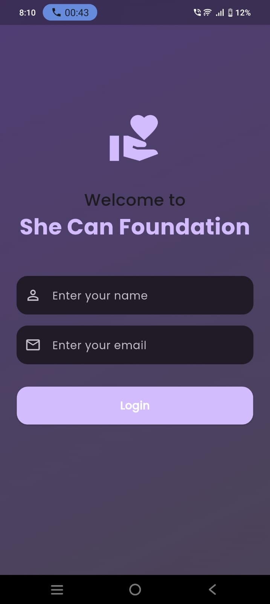
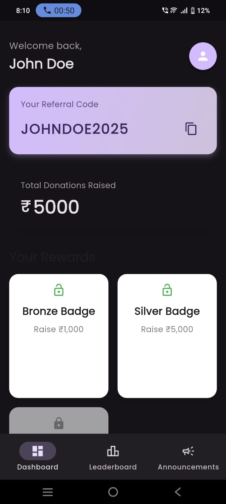
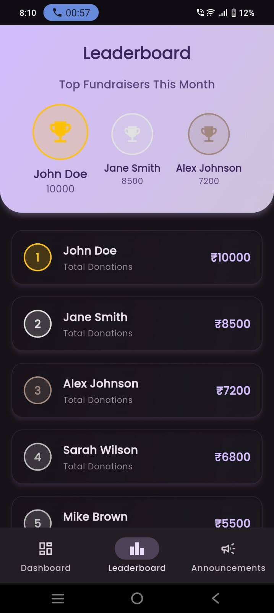
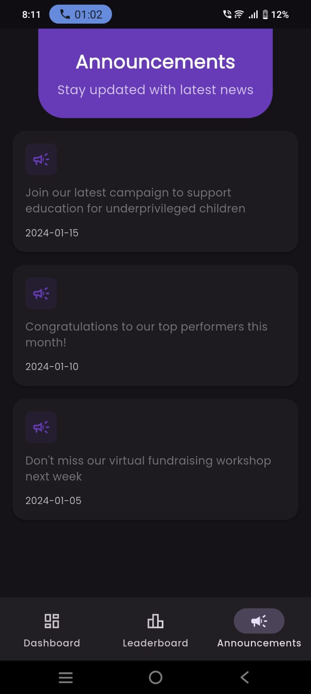

# She Can Foundation App

This is a mobile application developed for the "She Can Foundation" to manage donations, track leaderboard progress, and display announcements. The app features a modern UI/UX with animations and a clean design.

## Features

- **Login Screen**: Modern UI with gradient background, animated elements, and a responsive layout.
- **Dashboard Screen**: Displays user information, referral code, total donations raised (with an animated counter), and a grid of reward cards. Features Material 3 design and staggered animations.
- **Leaderboard Screen**: Shows top users with animated rank badges, a gradient header, and staggered list animations for the leaderboard tiles.
- **Announcements Screen**: Displays announcements with modern card designs and staggered animations.
- **Reward Cards**: Interactive reward cards with tap animations and visual feedback.
- **Leaderboard Tiles**: Glassmorphic design with gradient backgrounds, shimmer effects, and scaling animations.
- **Dark Mode Support**: Global theme provider with dark mode capabilities.
- **Animated Navigation**: Smooth transitions between main navigation screens.
- **Google Fonts Integration**: Consistent and modern typography throughout the app.

## Setup Instructions

To run this project locally, follow these steps:

1.  **Clone the repository**:
    ```bash
    git clone donation_app_ui
    cd donation_app_ui
    ```

2.  **Install Flutter dependencies**:
    ```bash
    flutter pub get
    ```

3.  **Run the application**:
    ```bash
    flutter run
    ```

## Dependencies

The project uses the following key dependencies:

-   `flutter_animate`: For various UI animations.
-   `google_fonts`: For custom font integration.
-   `animated_flip_counter`: For the animated donation counter.
-   `flutter_staggered_animations`: For staggered list animations.

<<<<<<< HEAD

## 📱 App Screenshots

### 🔐 Login/Sign-Up Screen


### 📊 Dashboard


### 🏆 Leaderboard


### 📢 Announcements



=======
>>>>>>> 7bc52d7c6353c189b19df99092eb2086cd4fed4d
## Project Structure

```
lib/
├── main.dart                 # Main application entry point and theme setup
├── models/                   # Data models (e.g., LeaderboardUser)
│   └── leaderboard_user.dart
├── screens/                  # UI screens of the application
│   ├── announcements_screen.dart
│   ├── dashboard_screen.dart
│   ├── leaderboard_screen.dart
│   └── login_screen.dart
├── utils/                    # Utility functions and dummy data
│   └── dummy_data.dart
└── widgets/                  # Reusable UI widgets
    ├── leaderboard_tile.dart
    └── reward_card.dart
```
